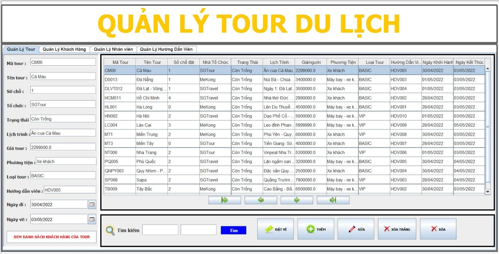
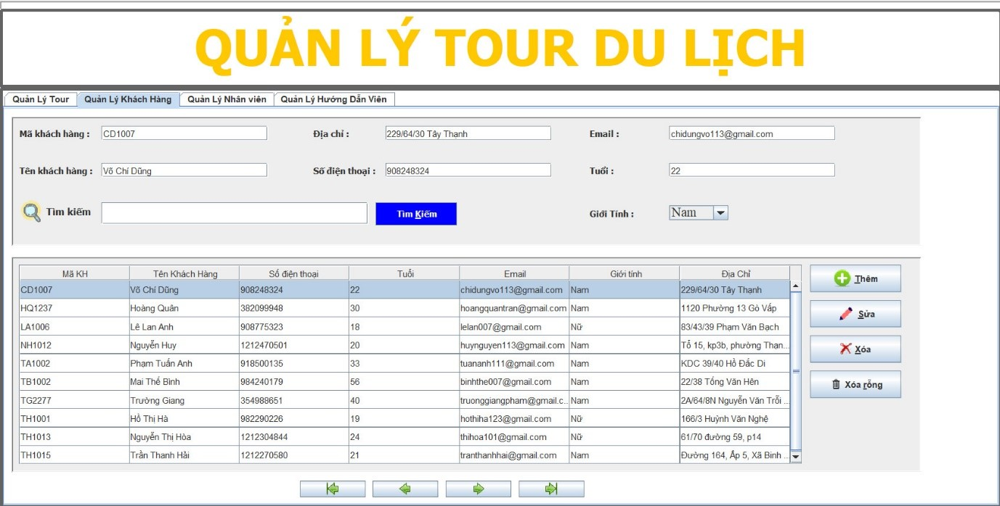
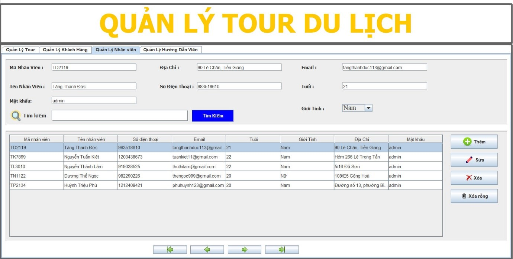
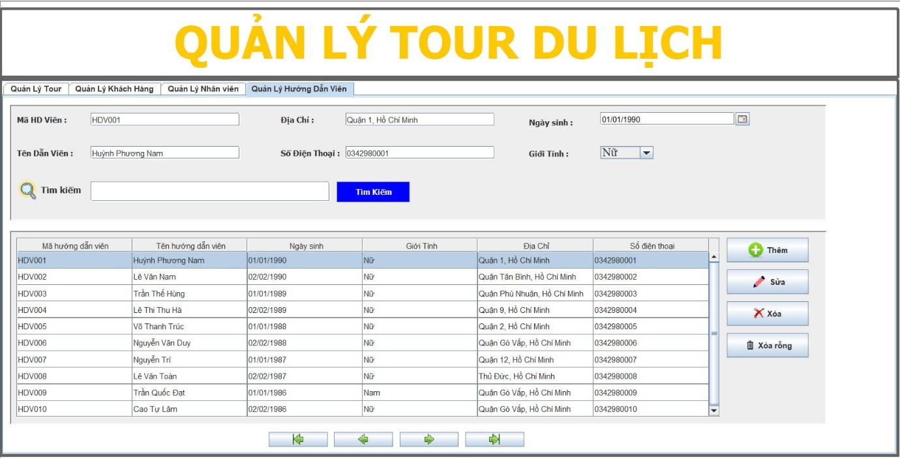

# Tourism_management_application
## ⭐ Introduction
-   Chương trình gồm thông tin giới thiệu danh mục các tuyến/chuyến và địa điểm du lịch, 
thông tin này sẽ được phân loại địa phương, theo ngày lên lịch chuyến đi của công ty. 
Ví dụ như địa điểm Phú Quốc, Hạ Long, Sa Pa có các chuyến đi vào các ngày X cụ thể.
Chương trình cho phép truy tìm thông tin về chuyến/tuyến/địa điểm du lịch theo tên, 
theo ngày (nếu trường hợp số lượng nhiều thì cần chia thành nhiều nhóm kết quả). 
Về phía công ty, nhân viên công ty cần hiệu chỉnh thông tin tuyến/chuyến/ địa điểm du 
lịch, cập nhật các hình ảnh giới thiệu các địa điểm. Ngoài ra nhân viên còn xử lý việc 
đặt vé và yêu cầu cung cấp tài khoản của khách hàng.
-   Yêu cầu: 
 Phân tích, thiết kế ứng dụng quản lý thông tin cho công ty du lịch với các đặc tả
ban đầu như trên, các đặc tả khác có thể mô tả thêm chi tiết. 
 Về phần thực hiện chương trình ứng dụng theo phân tích, thiết kế: 
 Tối thiểu chương trình bao gồm các chức năng chính: Thêm, xóa, cập nhật, 
liệt kê (dạng danh sách và chi tiết), tìm kiếm (đơn giản, nâng cao) dữ liệu của 
các bảng (lưu ý cập nhật, xóa dữ liệu của các bảng có quan hệ).
 Giao diện thân thiện, sử dụng các phím tắt, tab khi cần thiết.
 Phần viết code cần phải dùng Coding Convention

##  🤝 Experiments

  

 

 

 

## ⭐ Future Features

-   Pending

_Feel free to fork and contribute to include these features._ ❤︎

## 🚀 Technologies

 Programming tools and languages used:
  -   Database management system: MSSM SQL SEVER.
  -   Programming tools: Eclipse.
  -   Programming language: Java.

## 🤝 Contribute

To contribute, fork the repository and push the changes to the **master** branch. Then submit a pull request for merging with the source. If your code passes the review and checks it will be merged into the master branch.

## 💬 Feedback

Feel free to send us feedback on [Gmail] Feature requests are always welcome.

## 📝 License

Licensed under the [MIT License].

